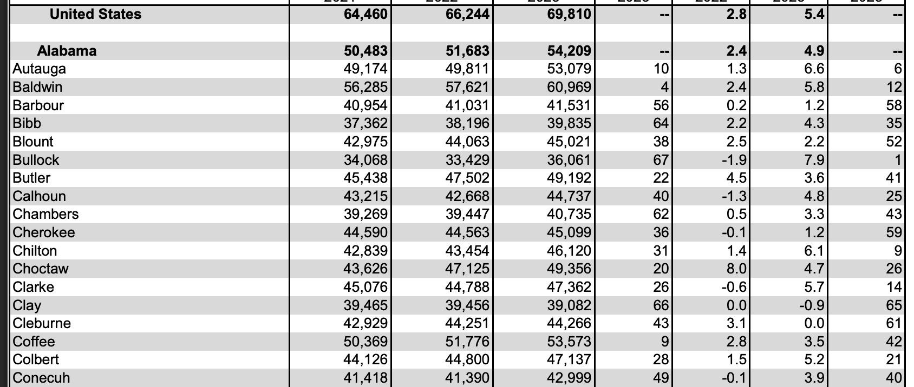
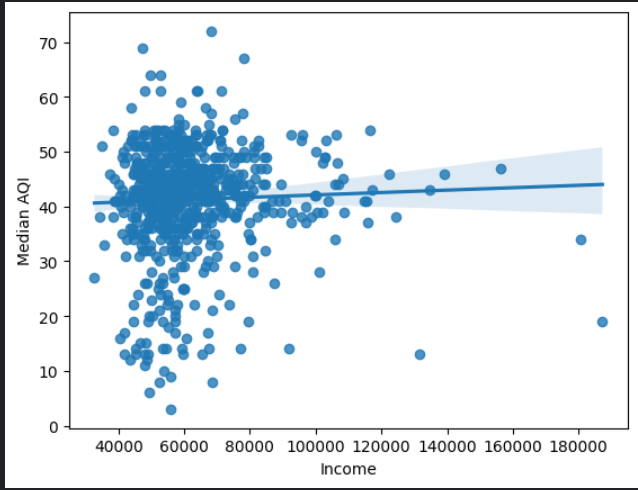

# The process

> *What is the correlation between air quality and wealth in the U.S.* 

We compared the AQI with the annual income of people in counties across the US.

The US Envirormental Protection Agency provided annual [data](https://aqs.epa.gov/aqsweb/airdata/download_files.html#Annual) on the air quality (AQI) of hundreds of counties in the United States. This had data on the *Median AQI*, *90th Percentile AQI*, and even numbers of *Very Unhealthy Days*. We chose to use the Median AQI because it would be less affected by incidents such as wildfires, making it a better indicator of normal air quality.

We found data on incomes for each county on the BEA (Bureau of Economic Analysis) website. This had entries for *every* county in the US. However, the formatting was not ideal. Each entry only had the county name, not the state the county belonged to. The formatting looked something like this:
<!-- {"width":220} -->

This would become a problem because we would need to uniquely match each entry in the *Incomes* data to entries in the *AQI* data. County names were not enough because they would frequently repeat. For example, there were *31 counties* named “Washington.” 

To solve this, we needed to create a column to specify the state of each county. We created a script to go through row by row and look for state names. Then it would label the counties after that with that state until we reached another row with a state name. 

Multiple team members did these cleaning steps differently. However, our resulted data ended up varying in lengths, ranging from 720 to 740 entries. This discrepency was due to county names being the name of a state, such as *Arkansas, Arkanasas* (bruh).

We combined both datasets and graphed it on a scatter plot. The resulting correlation was `0.0378385398857233`. We expected a medium-strong inverse correlation, and we believe this difference was becuase our data did not account for population in each county.
<!-- {"width":220} -->
