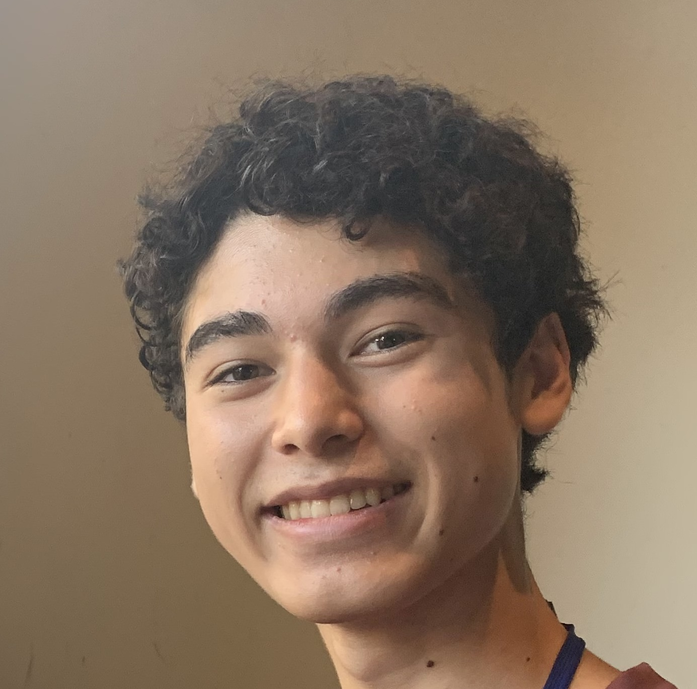
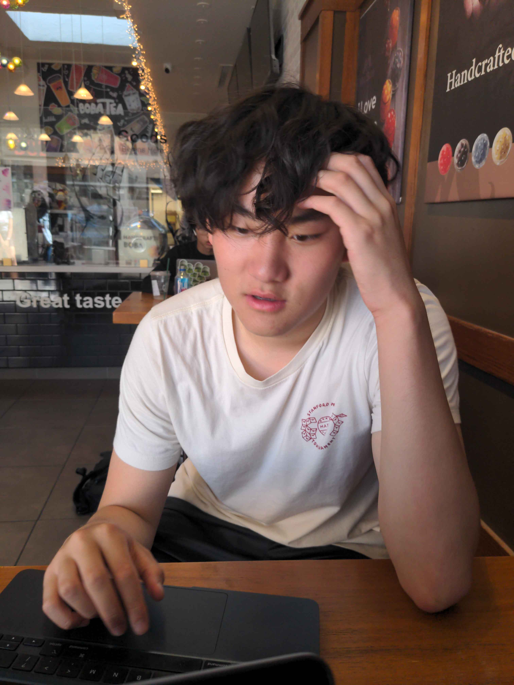

## About Us

Pattern Seekers Members
---

## Colin Haine

  

  

    

      Colin is a rising junior from the Bay Area
    

    <ul style="margin: 0; padding-left: 20px;">
      <li>Does FRC robotics</li>
      <li>Plays the saxophone</li>
      <li>Interested in computer science and robotics projects</li>
    </ul>
  

---

## Aiden Yuan

  

  

    

      Aiden is a rising senior from the Bay Area
    

    <ul style="margin: 0; padding-left: 20px;">
      <li>Enjoys playing badminton and basketball with friends</li>
      <li>Lives a very unproductive lifestyle</li>
      <li>Puts in lots of effort</li>
    </ul>
  

---

## Wisdom Li

  

  

    

      Wisdom Li is...
    

    <ul style="margin: 0; padding-left: 20px;">
      <li>A rising senior from the Bay Area</li>
      <li>Interested in exploring Data Science and Machine Learning</li>
      <li>Enjoys watching YouTube videos</li>
    </ul>
  

  

---

## Linda Meng

  

  

    

      Linda Meng is a rising senior from LA
    

    <ul style="margin: 0; padding-left: 20px;">
      <li>Interested in Social Sciences, Robotics and Computer Science</li>
      <li>Enjoys creative writing and drawing</li>
      <li>Orders boba every day</li>
    </ul>
  

  

---

## Mohini Gune

  

  

    

      Mohini Gune is ...
    

    <ul style="margin: 0; padding-left: 20px;">
      <li>From the Bay Area</li>
      <li>Interested in Financial Modeling, Data Science, and Econometrics</li>
      <li>Enjoys listening to music</li>
    </ul>
  

  

