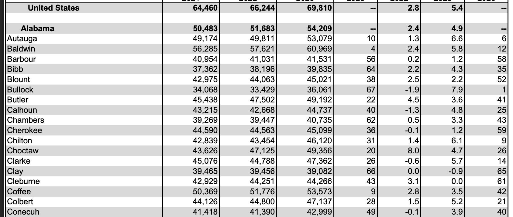
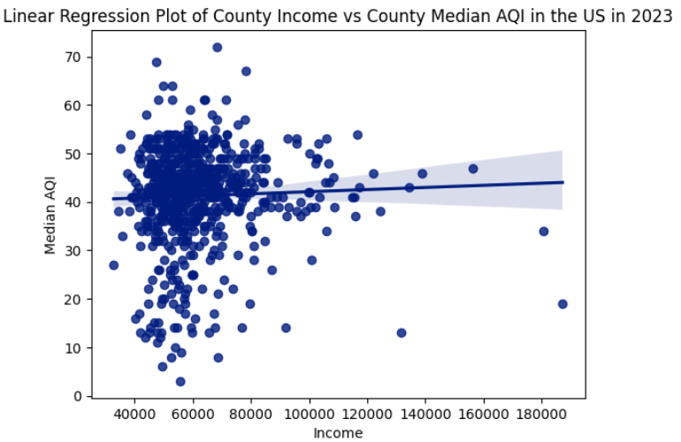

## Topic 

> ***What is the correlation between air quality and wealth in the U.S.?***

## Our Hypothesis

We compared the AQI with the annual income of people in counties across the US in 2023. We thought that there would be an inverse relationship between income and  air quality, since people with more economic resources have more options to live in areas with less pollution than individuals who have less finanical assets.

## Data Acquisition

The US Envirormental Protection Agency provided annual [data](https://aqs.epa.gov/aqsweb/airdata/download_files.html#Annual) on the air quality (AQI) of hundreds of counties in the United States. This had data on the *Median AQI*, *90th Percentile AQI*, and even numbers of *Very Unhealthy Days*. We chose to use the Median AQI because it would be less affected by incidents such as wildfires, making it a better indicator of normal air quality.

## Data Preprocessing

We found data on incomes for each county on the [BEA](https://www.bea.gov/data/income-saving/personal-income-county-metro-and-other-areas) (Bureau of Economic Analysis) website. This had entries for *every* county in the US. However, the formatting was not ideal. Each entry only had the county name, not the state the county belonged to. The formatting looked something like this:
<!-- {"width":220} -->

This would become a problem because we would need to uniquely match each entry in the *Incomes* data to entries in the *AQI* data. County names were not enough because they would frequently repeat. For example, there were *31 counties* named “Washington.” 

To solve this, we needed to create a column to specify the state of each county. We created a script to go through row by row and look for state names. Then it would label the counties after that with that state until we reached another row with a state name. 

Multiple team members did these cleaning steps differently. However, our resulted data ended up varying in lengths, ranging from 720 to 740 entries. This discrepency was due to county names being the name of a state, such as *Arkansas, Arkanasas*.

After some debugging, we combined both the income and air quality dataset into one comphrensive file.

## Data Modeling

We used a linear regression plot to graph our data, producing the following image:
<!-- {"width":220} -->

## Outcome

The resulting correlation was **0.0132**. We expected a medium-strong inverse correlation, and we believe this difference was due to the fact that counties hold tens of thousands to millions of people. With such a large population, is it very possible that there exists both affulent and decrepit neighborhoods within the counties. When taking the median AQI and average income of a county, the fine details often gets lost. To produce a more accurate result, it is a good idea to use smaller units of measurement like cities or city districts for future tests.

<iframe src="/income_aqi_full_data.html" width="716px" height="400px" style="border:none; overflow:hidden;" scrolling="no"></iframe>
