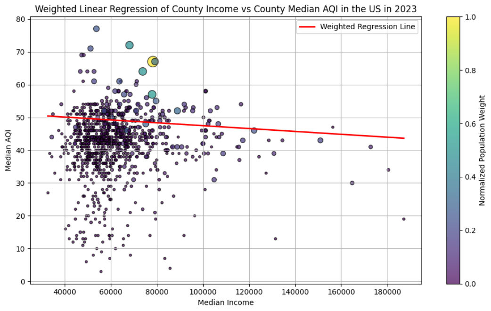

## Topic 

> ***What is the correlation between air quality and wealth in the U.S.?***

## Our Hypothesis

We compared the AQI with the annual income of people in counties across the US in 2023. We thought that there would be a moderate inverse relationship between income and  air quality, since people with more economic resources have more options to live in areas with less pollution than individuals who have less finanical assets.

## Data Acquisition

The US Environmental Protection Agency provided annual [data](https://aqs.epa.gov/aqsweb/airdata/download_files.html#Annual) on the air quality (AQI) of hundreds of counties in the United States. This had data on the *Median AQI*, *90th Percentile AQI*, and even numbers of *Very Unhealthy Days*. We chose to use the Median AQI because it would be less affected by incidents such as wildfires, making it a better indicator of normal air quality.

## Data Preprocessing

We found data on incomes for each county on the [BEA](https://www.bea.gov/data/income-saving/personal-income-county-metro-and-other-areas) (Bureau of Economic Analysis) website. This had entries for *every* county in the US. However, the formatting was not ideal. Each entry only had the county name, not the state the county belonged to. The formatting looked something like this:
<body>
  

    <table>
      <thead>
      <tr>
          <th></th>
          <th colspan="3">Average Income ($) </th>
        </tr>
        <tr>
          <th>Jurisdiction</th><th>2021</th><th>2022</th><th>2023</th>
        </tr>
      </thead>
      <tbody>
        <tr><td>United States</td><td>64,460</td><td>66,244</td><td>69,810</td>
        <tr><td><strong>Alabama</strong></td><td>50,483</td><td>51,683</td><td>54,209</td>
        <tr><td>Autauga</td><td>49,174</td><td>49,811</td><td>53,079</td>
        <tr><td>Baldwin</td><td>56,285</td><td>57,621</td><td>60,969</td>
        <tr><td>Barbour</td><td>40,954</td><td>41,031</td><td>41,531</td>
        <tr><td>Bibb</td><td>37,362</td><td>38,196</td><td>39,835</td>
      </tbody>
    </table>
  

</body> 

This would become a problem because we would need to uniquely match each entry in the *Incomes* data to entries in the *AQI* data. County names were not enough because they would frequently repeat. For example, there were *31 counties* named “Washington.” 

To solve this, we needed to create a column to specify the state of each county. We created a script to go through row by row and look for state names. Then it would label the counties after that with that state until we reached another row with a state name. 

Multiple team members did these cleaning steps differently. However, our resulted data ended up varying in lengths, ranging from 720 to 740 entries. This discrepency was due to county names being the name of a state, such as *Arkansas, Arkanasas*.

After some debugging, we combined both the income and air quality datasets into one comprehensive file.

## Data Modeling

We used a linear regression plot to graph our data, producing the following image:
<!-- {"width":300} -->

## Outcome

The resulting correlation was **0.0132**. We expected a medium-strong inverse correlation, and we believe this difference was due to the fact that all counties are considered equally, even if some counties are hundreds of times more populated than others. Our outcome would be more accurate if we added more weight to the counties with larger populations

## Revision

After creating a weighted regression model with the weight set to the populations of the counties, we produced a new graph. Along with fixing some issues earlier with the comprehensive dataset (we recovered 200 extra rows of information), our new correlation value became **-0.0878**, signifying a very weak correlation between income and median AQI. While this outcome does not fully match our original hypothesis of a moderate inverse relationship, it certainly was a lot closer than our first result. 
<!-- {"width":220} -->

## Interactive Data Map

<iframe src="/plotly/income_aqi.html" width="100%" height="400px" style="border:none;" scrolling="no"></iframe>

