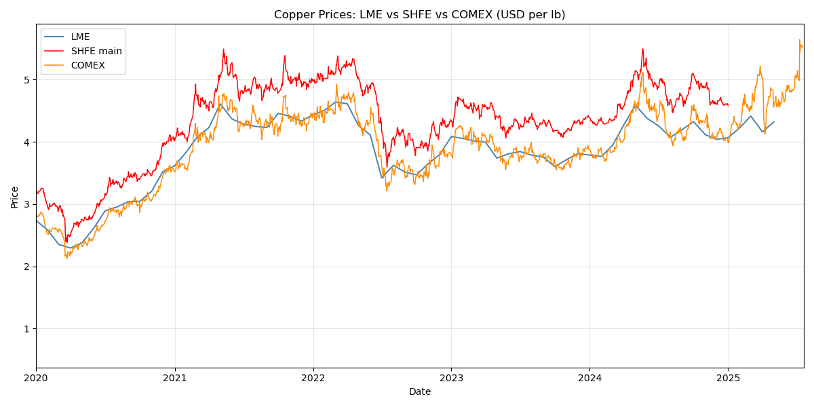
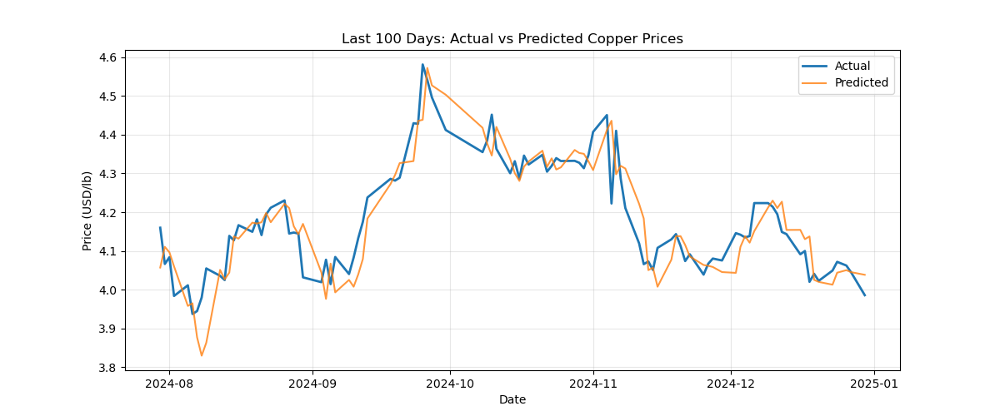

## Topic

> ***How accurately can we forecast COMEX copper prices using global market data?***

A copper future is a legally binding agreement to buy or sell a standard quantity of Grade-A cathode copper at a preset price for delivery (or cash‐settlement) on a future date. Producers hedge price risk, manufacturers lock-in costs, and speculators trade anticipated moves.

Copper is traded on several international futures exchanges. While prices generally move together, local factors (like tariffs) can create divergence. In this project, we investigate whether short-term COMEX (New York, United States) copper prices can be predicted using historical price patterns and information from other exchanges like SHFE (Shanghai, China) and LME (London, England).

## Hypothesis

We hypothesized that copper prices in the US (COMEX) are predictable using lagged pricing information and indicators derived from the other markets. Because copper contracts are traded globally and prices co-move, recent trends and spreads between exchanges should provide useful signs for prediction.

## Data Acquisition

We gathered daily price data from two main sources: the COMEX copper futures (in USD per pound) and SHFE copper futures (converted to USD per pound). These were joined into one dataset with aligned timestamps. The London Metal Exchange (LME) was excluded from the final prediction model due to the fact that LME data was only available monthly, while SHFE and COMEX data were daily. Since our model was trained to predict next-day prices, monthly data would not align with the daily format and would create lots of missing values or require mass interpolation.

### Summary of the Three Exchanges

| Exchange (venue code)                       | Contract unit        | Price quote   | Typical trading hours (local)         | Warehouse/delivery system                                   | Tick size                                                      |
| ------------------------------------------- | -------------------- | ------------- | ------------------------------------- | ----------------------------------------------------------- | -------------------------------------------------------------- |
| **London Metal Exchange – LME Copper (CA)** | 25 metric tonnes     | USD per tonne | 01:00–19:00 London (ring + LMEselect) | Global LME-approved sheds; *“warrants”* transferable        | USD 0.10/tonne ([LME][1])                                      |
| **Shanghai Futures Exchange – SHFE 铜 (CU)** | 5 t                  | CNY per ton   | 09:00–15:00 & 21:00–02:00 Beijing     | Mainland China warehouses; VAT & import‐quota rules apply   | ¥10/ton (≈USD 1.4) ([SHFE][2], [Barchart][3])                  |
| **CME Group / COMEX Copper (HG)**           | 25,000 lb (≈11.34 t) | USD ¢ per lb  | 18:00–17:00 ET (electronically)       | U.S. COMEX-licensed warehouses; deliverable Grade 1 cathode | USD 0.0005/lb ([CME Spec][4], [CME Page][5])                   |

[1]: https://www.lme.com/en/metals/non-ferrous/lme-copper/contract-specifications?utm_source=chatgpt.com
[2]: https://tsite.shfe.com.cn/eng/market/futures/metal/cu/index.html?utm_source=chatgpt.com
[3]: https://www.barchart.com/futures/quotes/VC%2A0/profile?utm_source=chatgpt.com
[4]: https://www.cmegroup.com/markets/metals/base/copper.contractSpecs.html?utm_source=chatgpt.com
[5]: https://www.cmegroup.com/markets/metals/base/copper.html?utm_source=chatgpt.com

## Feature Engineering

We engineered several time-series features to capture pricing trends and signals:

- **Lagged prices** - prices from 1, 2, 3, and 5 days prior.
- **Moving averages** - 5-day and 20-day simple moving averages.
- **Deviation from moving average** - the difference between the current price and 5-day MA.
- **Spread** - the difference between COMEX and SHFE prices.
- **Volatility** - 5-day rolling standard deviation of prices.

## Model Selection and Tuning

We chose to use **XGBoost**, a gradient-boosted tree model, for its ability to handle nonlinear, tabular (data that is structured into rows and columns) and time series features well. We used 80% of the data for training and 20% for testing, selected randomly. The model was trained to predict the next day’s COMEX copper price, using only past information.

(explain gridsearchCV+tuning)

## Model Evaluation

The model achieved the following performance:

| Metric | Value |
|--------|-------|
| Training MAE | $0.0251 |
| Test MAE | $0.0598 |
| Test R² | 0.9304 |
| Error as % of Price | 1.48% |

(explain)

## Feature Importance

We extracted feature importances from the trained XGBoost model to understand what signals mattered most:

| Feature | Importance |
|---------|------------|
| price_lag_1 | 0.574242 |
| ma_5 | 0.404583 |
| price_lag_2 | 0.015629 |
| diff_from_ma5 | 0.002304 |
| price_lag_3 | 0.001256 |
| price_lag_5 | 0.000647 |
| spread | 0.000550 |
| volatility | 0.000422 |
| ma_20 | 0.000367 |

Short-term momentum signals, especially the previous day’s price, were the most influential. Medium-term averages and SHFE price spreads had almost no impact. This suggests that while copper prices are globally connected, most of the short-term predictability comes from local trends in the COMEX market itself.

## Conclusion

Our hypothesis was largely supported: copper prices on COMEX can be accurately forecasted using a set of lag-based features. However, we found that foreign price signals like SHFE spreads were less helpful than expected, short-term memory in price series was highly predictive. 
