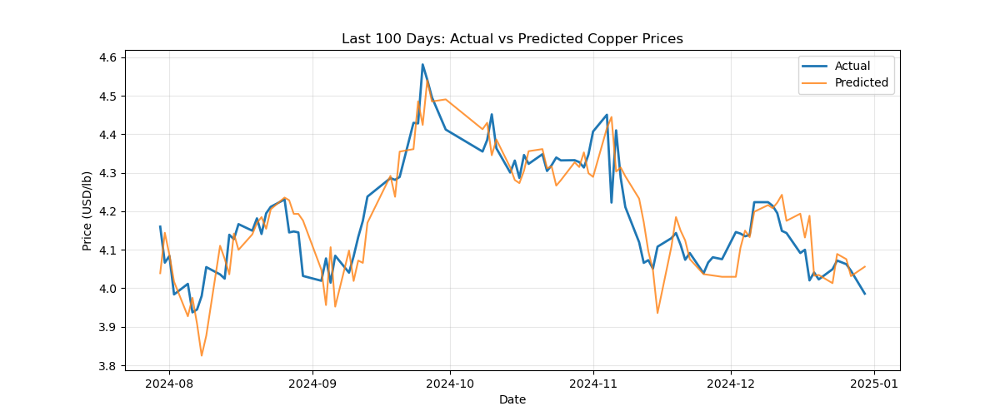

## Topic

## Hypothesis

## Data Acquisition

### Summary of the Three Exchanges
| Exchange (venue code)                       | Contract unit        | Price quote   | Typical trading hours (local)         | Warehouse/delivery system                                   | Tick size                                                      |
| ------------------------------------------- | -------------------- | ------------- | ------------------------------------- | ----------------------------------------------------------- | -------------------------------------------------------------- |
| **London Metal Exchange – LME Copper (CA)** | 25 metric tonnes     | USD per tonne | 01:00-19:00 London (ring + LMEselect) | Global LME-approved sheds; *“warrants”* transferable        | USD 0.10/tonne ([Lme][1])                                      |
| **Shanghai Futures Exchange – SHFE 铜 (CU)** | 5 t                  | CNY per ton   | 09:00-15:00 & 21:00-02:00 Beijing     | Mainland China warehouses; VAT & import‐quota rules apply   | ¥10/ton (≈USD 1.4) ([tsite.shfe.com.cn][2], [Barchart.com][3]) |
| **CME Group / COMEX Copper (HG)**           | 25 000 lb (≈11.34 t) | USD ¢ per lb  | 18:00-17:00 ET (electronically)       | U.S. COMEX-licensed warehouses; deliverable Grade 1 cathode | USD 0.0005/lb ([CME Group][4], [CME Group][5])                 |

[1]: https://www.lme.com/en/metals/non-ferrous/lme-copper/contract-specifications?utm_source=chatgpt.com "Contract specifications | London Metal Exchange"
[2]: https://tsite.shfe.com.cn/eng/market/futures/metal/cu/index.html?utm_source=chatgpt.com "Copper"
[3]: https://www.barchart.com/futures/quotes/VC%2A0/profile?utm_source=chatgpt.com "SHFE Copper Aug '25 Futures Contract Specifications - Barchart.com"
[4]: https://www.cmegroup.com/markets/metals/base/copper.contractSpecs.html?utm_source=chatgpt.com "Copper Futures Contract Specs - CME Group"
[5]: https://www.cmegroup.com/markets/metals/base/copper.html?utm_source=chatgpt.com "Copper Futures Overview - CME Group"

## Model Performance Evaluation

| Metric | Value |
|--------|-------|
| Training MAE | $0.0300 |
| Test MAE | $0.0543 |
| Test R² | 0.9394 |
| Error as % of Price | 1.35% |

## Feature Importance

| Feature | Importance |
|---------|------------|
| price_lag_1 | 0.540529 |
| price_lag_2 | 0.328109 |
| ma_5 | 0.126359 |
| price_lag_3 | 0.001779 |
| diff_from_ma5 | 0.001672 |
| price_lag_5 | 0.000710 |
| ma_20 | 0.000401 |
| spread | 0.000228 |
| volatility | 0.000212 |
