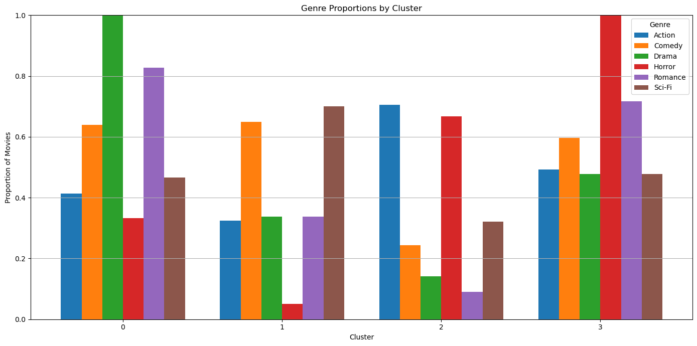

> Webpage is still a WIP

## The Question

> *How can we recommend movies based on similarity?* 

## Exploratory Data Analysis

## Dimension reduction

Note: We dropped the original *"cluster"* column in the dataset. The tSNE dimension reduction did not get to use given clustering data. For this reason, this graph may look different, less clustered, than other groups'.

## Clustering

## Cluster interpretation

- Cluster 1 is drama and romance movies
- Cluster 2 is lighthearted comedy and sci fi movies
- Cluster 3 is dramatic action movies
- Cluster 4 is horror movies
