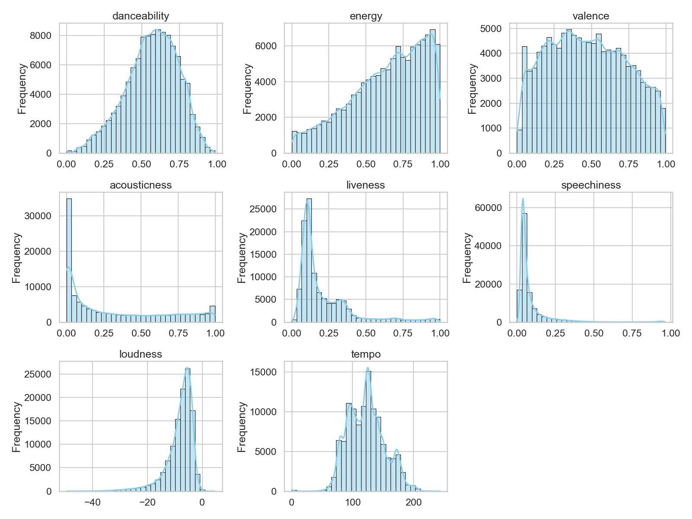

# Topic

> ***How can we determine the popularity of a song/album given its features (duration, danceability, loudness, tempo, etc)?***

## Hypothesis

By training a machine learning model through various input features, we can predict the target variable, popularity. Popularity is on a scale between 0-100, with 100 being the most popular song.

## Data Acquisition

We used the spotify tracks [dataset](https://www.kaggle.com/datasets/maharshipandya/-spotify-tracks-dataset) found on Kaggle. The file contained 114,000 rows of different songs with 20 columns.

<body>

  <table class="scroll-table">
    <thead>
      <tr>
        <th>track_id</th>
        <th>artists</th>
        <th>album_name</th>
        <th>track_name</th>
        <th>popularity</th>
        <th>duration_ms</th>
        <th>explicit</th>
        <th>danceability</th>
        <th>energy</th>
        <th>key</th>
        <th>loudness</th>
        <th>mode</th>
        <th>speechiness</th>
        <th>acousticness</th>
        <th>instrumentalness</th>
        <th>liveness</th>
        <th>valence</th>
        <th>tempo</th>
        <th>time_signature</th>
        <th>track_genre</th>
      </tr>
    </thead>
    <tbody>
      <tr>
        <td>5SuOikwiRyPMVoIQDJUgSV</td>
        <td>Gen Hoshino</td>
        <td>Comedy</td>
        <td>Comedy</td>
        <td>73</td>
        <td>230666</td>
        <td>False</td>
        <td>0.676</td>
        <td>0.4610</td>
        <td>1</td>
        <td>-6.746</td>
        <td>0</td>
        <td>0.1430</td>
        <td>0.0322</td>
        <td>0.000001</td>
        <td>0.3580</td>
        <td>0.715</td>
        <td>87.917</td>
        <td>4</td>
        <td>acoustic</td>
      </tr>
      <tr>
        <td>4qPNDBW1i3p13qLCt0Ki3A</td>
        <td>Ben Woodward</td>
        <td>Ghost (Acoustic)</td>
        <td>Ghost - Acoustic</td>
        <td>55</td>
        <td>149610</td>
        <td>False</td>
        <td>0.420</td>
        <td>0.1660</td>
        <td>1</td>
        <td>-17.235</td>
        <td>1</td>
        <td>0.0763</td>
        <td>0.9240</td>
        <td>0.000006</td>
        <td>0.1010</td>
        <td>0.267</td>
        <td>77.489</td>
        <td>4</td>
        <td>acoustic</td>
      </tr>
      <tr>
        <td>1iJBSr7s7jYXzM8EGcbK5b</td>
        <td>Ingrid Michaelson;ZAYN</td>
        <td>To Begin Again</td>
        <td>To Begin Again</td>
        <td>57</td>
        <td>210826</td>
        <td>False</td>
        <td>0.438</td>
        <td>0.3590</td>
        <td>0</td>
        <td>-9.734</td>
        <td>1</td>
        <td>0.0557</td>
        <td>0.2100</td>
        <td>0.000000</td>
        <td>0.1170</td>
        <td>0.120</td>
        <td>76.332</td>
        <td>4</td>
        <td>acoustic</td>
      </tr>
      <tr>
        <td>6lfxq3CG4xtTiEg7opyCyx</td>
        <td>Kina Grannis</td>
        <td>Crazy Rich Asians (Original Motion Picture Soundtrack)</td>
        <td>Can't Help Falling In Love</td>
        <td>71</td>
        <td>201933</td>
        <td>False</td>
        <td>0.266</td>
        <td>0.0596</td>
        <td>0</td>
        <td>-18.515</td>
        <td>1</td>
        <td>0.0363</td>
        <td>0.9050</td>
        <td>0.000071</td>
        <td>0.1320</td>
        <td>0.143</td>
        <td>181.740</td>
        <td>3</td>
        <td>acoustic</td>
      </tr>
      <tr>
        <td>5vjLSffimiIP26QG5WcN2K</td>
        <td>Chord Overstreet</td>
        <td>Hold On</td>
        <td>Hold On</td>
        <td>82</td>
        <td>198853</td>
        <td>False</td>
        <td>0.618</td>
        <td>0.4430</td>
        <td>2</td>
        <td>-9.681</td>
        <td>1</td>
        <td>0.0526</td>
        <td>0.4690</td>
        <td>0.000000</td>
        <td>0.0829</td>
        <td>0.167</td>
        <td>119.949</td>
        <td>4</td>
        <td>acoustic</td>
      </tr>
    </tbody>
  </table>

</body>

## Data Preprocessing

After dropping columns that had minimal correlation to popularity, since most models only accepted numerical inputs, we created a pipeline to impute missing values and one hot encode categorical values. We ended up using 14 features (duration_ms, explicit, danceability, energy, key, loudness, mode, speechiness, acousticness, instrumentalness, liveness, valence, tempo, and time_signature) to create the machine learning model. 

## Exploratory Data Analysis

Before running the model, we explored the dataset to gain deeper insights. We found that the average song popularity is 33.2, with a standard deviation (STD) of 22.3. This means that the popularity of songs in the file can widely differ from one another. Afterwards, we used various plots to explore the data further. 

Histogram of song popularity:
<iframe src="/plotly/updated_histogram.html" width="100%" height="400px" style="border:none;" scrolling="no"></iframe>

Subplot of various audio features:
<!-- {"width":300} -->

As seen in the histogram, many songs have a very low (0-4) popularity score. We first thought that the person who made the dataset assigned a popularity score of 0 to songs where the popularity data does not exist. However, after reading through the description of the dataset, we realized that popularity was calculated using a formula that focuses mainly on how many recent plays the songs had. From this, we deduced that these songs had a very low popularity value probably because they did not have a lot of recent streams, and not due to missing data. As a result, we chose to keep these songs in the dataset.

## Data Modeling

We settled on using RandomForestRegressor as our machine learning model due to its simple parameters and general robustness with big datasets. After dropping the popularity column and setting it as the target variable, we then split the dataset into a training and testing dataset, putting 80% of the rows for training and 20% for validation. To avoid data leakage, we again used a pipeline to link the preprocessed data with the model. For our model, we used 100 trees and set random_state to 0 to ensure reproducibility. 

## Data Validation

After fitting the model to the dataset, we used the testing dataset to evaluate our model performance. We found that the mean absolute error (MAE) of the model was 10.7. The produced MAE/STD ratio was 0.48, meaning that the model reduced the average error by around 52% compared to the strategy of guessing the mean popularity on every song. While the model is not particularly great at accurately predicting the popularity of songs, it is still noticeably better than simply guessing the popularity. Since the MAE/STD ratio is under 0.5, it is still generally considered a good model.
