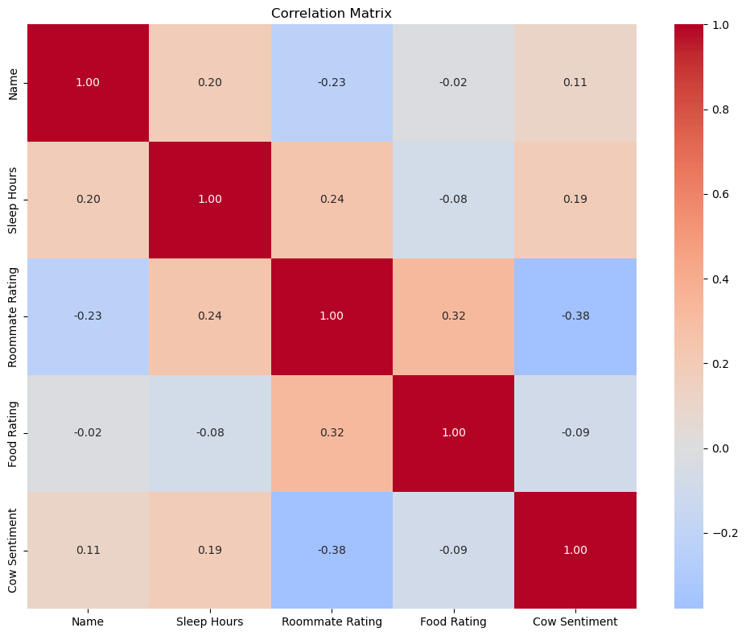

## The questions:
We surveyed our roomates on these five questions:
- What is your name? *(on a scale of 1-3)*
- How many hours of sleep did you get yesterday? *(free response)*
- Rate your roommate on a scale of 1-10.
- How good is the food? *(on a scale of 1-5)*
- What is the best group? *(between Pattern Seekers or Group 5)*
- *How is the cow? (free response)*

## Data cleaning
We recieved 16 responses, but they were quite messy and required further cleaning.

First, we needed to turn the *Sleep Hours* responses into numbers. We filtered out any string and any value below zero or above twelve. Almost half of the entries were unsuable. Removing those entire rows would result a huge loss of data, so we *imputed* the *Sleep Hours* with the average of the usable data.

## The findings
1. The average amount of sleep is **5.65 hours**.
2. The average roomate rating is **8.67/10**. The median was 10! 
3. The average food rating is **2.73/5**. The median was 3/5.
4. The most common response to *How is the cow* is “**good**” and "**moo**”, with 3 responses each.
5. 62% of respondents said their name was “2”. This means that people will commonly choose the middle option when asked to choose between three arbritrary values.
6. 62.5% said *Pattern Seekers* were the best group and 37.5% said *Group 5* was best. Both of them are referring to us, so that means **100%** say that we are the best group!

## Finding correlations
We wanted to do further analysis seeing what correlations existed between the values of the responses. 

To do so, we needed to turn the string responses to *How is the cow* into numerical values. We analyzed the *sentiment* of each of the various responses using *vaderSentiment*, assigning each response a value from -1 (negative) to +1. For example, the response *“good”* revieved a value of +0.44, and *“moo”* received a value of 0 (completely neutral). Nobody attributed any negative feelings to the cow.

A correlation matrix shows the strength and direction of linear relationships between pairs of variables in a dataset.
<!-- {"width":429} -->
The values in a correlation matrix range from -1 to 1, where -1 indicates a perfect negative linear relationship, 0 means no linear relationship, and 1 indicates a perfect positive linear relationship.

Here’s what we found:
1. **People who get more sleep tend to also rate their roommate highly** *(or vise versa)*
2. **People who rate their roommate highly tend to also rate the food highly**
3. **People who rate their roomate highly are *less* likely to say something positive about the cow**

